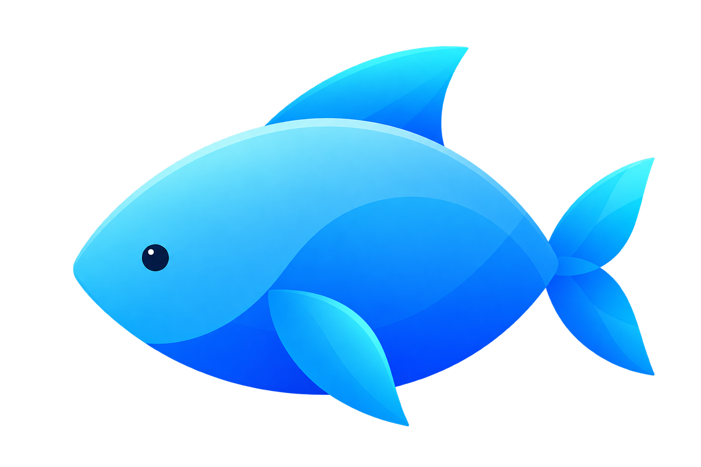

<div align="center">



# 🐟 Fish

**Hệ thống Điều phối Build Tốc độ cao, Ưu tiên Cache cho Monorepo Đa ngôn ngữ**

[](https://github.com/requla11/fish/actions/workflows/dogfood.yaml)
[](LICENSE)
[](https://www.rust-lang.org)
[](https://doc.rust-lang.org/edition-guide/rust-2024/index.html)
[](https://codespaces.new/requla11/fish)

[English](README.md) • [Tiếng Việt](README.vi.md) • [简体中文](README.zh-hans.md) • [繁體中文](README.zh-hant.md) • [日本語](README.ja.md)

</div>

---

**Fish** là bộ máy điều phối build hiệu năng cực cao được phát triển bằng **Rust 2024**. Fish kết hợp tốc độ và sự tinh gọn của Turborepo với sức mạnh đa ngôn ngữ của Bazel — **hoàn toàn không đòi hỏi các ngôn ngữ cấu hình phức tạp như Starlark hay DSL tùy biến**.

Fish tự động phát hiện các toolchain của bạn, phân tích cây mã nguồn để suy luận quan hệ phụ thuộc giữa các ngôn ngữ, lập lịch tác vụ qua hàng đợi work-stealing không khóa (lock-free), và lưu trữ toàn bộ artifact bằng hệ thống lưu trữ định danh nội dung (CAS) mã hóa **BLAKE3** cùng thuật toán nén **Zstandard**.

> 💡 **Lưu ý:** Fish điều phối các trình biên dịch và trình quản lý gói hiện có (Cargo, Go, npm/pnpm, Python, Clang,...), chứ không thay thế chúng. Dự án không liên quan đến [fish-shell](https://fishshell.com) — hai bên chỉ trùng tên gọi.

---

## ✨ Điểm nổi bật Cốt lõi

| Tính năng | Mô tả chi tiết |
| :--- | :--- |
| ⚡ **Lập lịch Dưới Mili-giây** | Hàng đợi Chase-Lev work-stealing và lập lịch đường găng điều phối tác vụ với độ trễ <100µs. |
| 🌐 **11+ Hệ sinh thái Ngôn ngữ** | Backend gốc cho Rust, Go, TypeScript/JS, Python, C/C++, Java, .NET, Swift, Dart, Zig và Docker. |
| 🔗 **Tự động Suy luận Phụ thuộc** | Cơ chế contract-first: tham chiếu tệp (`include_str!`, import JSON) tự động nối các cạnh DAG mà không cần khai báo `depends_on`. |
| 💾 **Cache CAS Thông lượng cao** | Bộ lưu trữ BLAKE3 loại bỏ trùng lặp với cơ chế cache phân tầng L1/L2 và nén ZSTD siêu nhanh. |
| 📡 **Cache P2P Không Cấu hình** | Chia sẻ artifact build ngang hàng qua mạng Wi-Fi / LAN nội bộ với đồng đội — hoàn toàn miễn phí máy chủ cloud. |
| 🛡️ **Môi trường Cô lập Hermetic** | Sandbox đa nền tảng: Linux namespaces & Landlock, macOS seatbelt và Windows security tokens. |
| 📊 **Dashboard Web Thời gian thực** | Giao diện web tích hợp sẵn (`fish ui`) với trình hiển thị DAG dạng SVG tương tác và đo lường telemetry. |

---

## 🚀 Cài đặt Nhanh

### Cài đặt 1 Dòng lệnh

#### Linux & macOS
```bash
curl -fsSL https://raw.githubusercontent.com/requla11/fish/main/scripts/install.sh | sh
```

#### Windows (PowerShell)
```powershell
irm https://raw.githubusercontent.com/requla11/fish/main/scripts/install.ps1 | iex
```

---

### Trình quản lý Gói (Package Managers)

| Nền tảng | Trình quản lý | Câu lệnh |
| :--- | :--- | :--- |
| **Windows** | **Scoop** | `scoop install https://raw.githubusercontent.com/requla11/fish/main/packaging/fish.json` |
| **Windows** | **Winget** | `winget install requla11.fish` |
| **macOS** | **Homebrew** | `brew tap requla11/fish https://github.com/requla11/homebrew-fish && brew install fish` |
| **Cargo** | **crates.io / Git** | `cargo install --git https://github.com/requla11/fish.git fish-cli` |

---

## 🏁 Bắt đầu Nhanh

Mở terminal tại thư mục gốc của bất kỳ dự án đa ngôn ngữ nào và chạy:

```bash
# Build toàn bộ workspace song song với bộ nhớ đệm thông minh
fish build

# Chạy toàn bộ test suite của tất cả ngôn ngữ
fish test

# Chế độ theo dõi: tự động build và test lại khi có tệp thay đổi
fish dev

# Dọn dẹp artifact build (thêm --all để dọn sạch toàn bộ cache ~/.fish/cache)
fish clean --all

# Khởi chạy giao diện Web Dashboard & trực quan hóa DAG
fish ui --open
```

### Trải nghiệm Dự án Mẫu Polyglot Demo

Fish đi kèm một dự án monorepo mẫu kết hợp **Rust + Go + Python + TypeScript**:

```bash
cd examples/polyglot-demo
fish build
fish graph --format tree
```

Kết quả:
```text
🔗 Inferring cross-language dependencies:
   ↳ go-service → py-worker (Go project references `../py-worker/contracts/events.schema.json`)
   ↳ rust-service → py-worker (Rust project references `../../py-worker/contracts/events.schema.json`)
   ↳ web-frontend → py-worker (TypeScript project references `../../py-worker/contracts/topics.json`)
🔗 Linked 6 cross-project task edge(s) from 3 inference(s)

Build completed successfully.
  Tasks:     7 total (7 cached, 100% cache hit)
  Duration:  0.01s
```

---

## 🛠️ Các Hệ sinh thái Hỗ trợ

Fish tự động nhận diện và điều phối các dự án thuộc 11 hệ sinh thái phổ biến:

| Hệ sinh thái | Tệp nhận diện | Tác vụ mặc định |
| :--- | :--- | :--- |
| **Rust** | `Cargo.toml` | `cargo check`, `cargo build`, `cargo test` |
| **TypeScript / Node** | `package.json`, `tsconfig.json` | `typecheck`, `build`, `test` |
| **Go** | `go.mod` | `go vet`, `go build`, `go test` |
| **Python** | `pyproject.toml`, `requirements.txt` | biên dịch cú pháp, `pytest`, lint |
| **C / C++** | `CMakeLists.txt`, `fish.cc.json` | CMake configure, build, `ctest` |
| **Java** | `pom.xml`, `build.gradle` | compile, test |
| **.NET / C#** | `*.csproj`, `*.sln` | `dotnet build`, `dotnet test` |
| **Swift** | `Package.swift` | `swift build`, `swift test` |
| **Dart / Flutter** | `pubspec.yaml` | `dart analyze`, `dart test` |
| **Zig** | `build.zig` | `zig build`, `zig test` |
| **Docker / OCI** | `Dockerfile`, `docker-compose.yml` | Đóng gói ảnh đa tầng, biên dịch OCI |

---

## 📋 Bảng Tra cứu Lệnh CLI

Fish giữ cho giao diện dòng lệnh luôn trực quan, tinh gọn và thân thiện:

```text
Biên dịch & Kiểm thử:
  fish build             Build tất cả các mục tiêu được phát hiện trong đồ thị dự án
  fish check             Kiểm tra kiểu dữ liệu và cú pháp nhanh chóng (không link nhị phân)
  fish test              Chạy toàn bộ các bộ kiểm thử tự động trên workspace
  fish run [TARGET]      Biên dịch và chạy một binary được chỉ định
  fish dev (hoặc watch)  Theo dõi thay đổi mã nguồn và tự động rebuild gia tăng

Quan sát & Phân tích:
  fish graph             Hiển thị cây phụ thuộc DAG (dạng tree, DOT hoặc JSON)
  fish why <QUERY>       Hỏi bằng ngôn ngữ tự nhiên lý do một mục tiêu bị build lại
  fish ui                Mở Dashboard web thời gian thực & đồ thị DAG tương tác
  fish doctor            Chẩn đoán toolchain cài đặt, tính toàn vẹn của cache và môi trường

Dọn dẹp & Khắc phục:
  fish clean             Dọn dẹp thư mục build (truyền -a/--all để xóa cả ~/.fish/cache)
  fish fix               Chẩn đoán lỗi biên dịch bằng AI và tự động sửa chữa
  fish ci init           Tạo quy trình CI/CD tối ưu (GitHub Actions, GitLab,...)
  fish affected          Chỉ build hoặc test các gói bị ảnh hưởng bởi thay đổi git
```

---

## 🏗️ Kiến trúc & Bố cục Thư mục Workspace

Hệ thống được tổ chức thành một Rust workspace gồm 28 crates với ranh giới rõ ràng:

```text
crates/
  fish-core/         Phát hiện workspace, mô hình manifest và bộ hợp nhất DAG
  fish-graph/        Đồ thị phụ thuộc, sắp xếp tô-pô và đại số truy vấn
  fish-executor/     Thực thi tiến trình, chuỗi middleware và tệp phản hồi response file
  fish-scheduler/    Lập lịch song song work-stealing, GNU jobserver pool, racing và DTE
  fish-cache/        Bộ nhớ đệm fingerprint, cắt tỉa 2 giai đoạn và morphic hash
  fish-cas/          Lưu trữ artifact định danh nội dung với nén BLAKE3 + ZSTD
  fish-incremental/  Phát hiện thay đổi, suy luận AST và giải thích dirty rebuild
  fish-backend-*/    11 adapter ngôn ngữ triển khai trait EcosystemBackend
  fish-worker/       Máy chủ thực thi phân tán và giao thức streaming VFS
  fish-remote-cache/ Máy chủ remote cache thông lượng cao với xác thực chữ ký Ed25519
  fish-security/     Bảo mật đa lớp, quét lỗ hổng OSV và chứng thực nguồn gốc SLSA
  fish-cli/          Ứng dụng dòng lệnh hợp nhất, daemon IPC và render terminal
submodules/          Các bộ máy cô lập đồng hành:
  apple/             Sandbox hermetic và daemon cô lập tiến trình hệ điều hành
  banana/            Mạng P2P swarm mesh, đóng gói container OCI và sổ cái Merkle
examples/            Các dự án monorepo mẫu sẵn sàng chạy
```

---

## 🌿 Chính sách Phân nhánh (Branch Policy)

Fish tuân thủ vòng đời nhánh nghiêm ngặt:

```text
dev (phát triển tính năng, kiểm thử, sửa lỗi)
  ↓
  ↓ kiểm tra: cargo test --workspace & cargo clippy
  ↓
main (bản phát hành ổn định cho sản xuất)
```

- **`dev`** — Tất cả công việc phát triển, nhánh tính năng và pull request đều được thực hiện tại đây.
- **`main`** — Chỉ chứa mã nguồn đã ổn định và gắn tag release chính thức.

---

## 🧪 Kiểm thử & Xác thực Mã nguồn

Để kiểm tra toàn bộ workspace trên máy cục bộ:

```bash
cargo fmt --all -- --check
cargo clippy --workspace --all-targets --all-features -- -D warnings
cargo test --workspace
```

---

## 📖 Tài liệu & Cộng đồng

- [Kiến trúc Hệ thống](ARCHITECTURE.md) — Chi tiết thiết kế kiến trúc và các thành phần cốt lõi.
- [Hướng dẫn Phát triển](DEVELOPMENT.md) — Cài đặt môi trường lập trình, debug và benchmark.
- [Lộ trình Phát triển](ROADMAP.md) — Các mốc đã hoàn thành và mục tiêu tương lai.
- [Hướng dẫn Đóng góp](CONTRIBUTING.md) — Cách tạo đề xuất tính năng và bổ sung backend mới.
- [Quy trình AI Agent](docs/AI_AGENT_WORKFLOW.md) — Quy tắc và quy trình làm việc chuẩn cho các AI agent.

---

## 📄 Bản quyền & Tuyên bố Miễn trừ Trách nhiệm

Fish được phát hành theo giấy phép [Giấy phép MIT](LICENSE).

> **Tuyên bố:** Fish là một hệ thống điều phối build hoàn toàn độc lập. Các công cụ hoặc gói phần mềm khác có chứa chữ "fish" trong tên (như `fish-shell`, `fish-image`,...) là các dự án độc lập và không có bất kỳ mối liên hệ, tài trợ hay bảo trợ nào với dự án Fish build orchestration.
